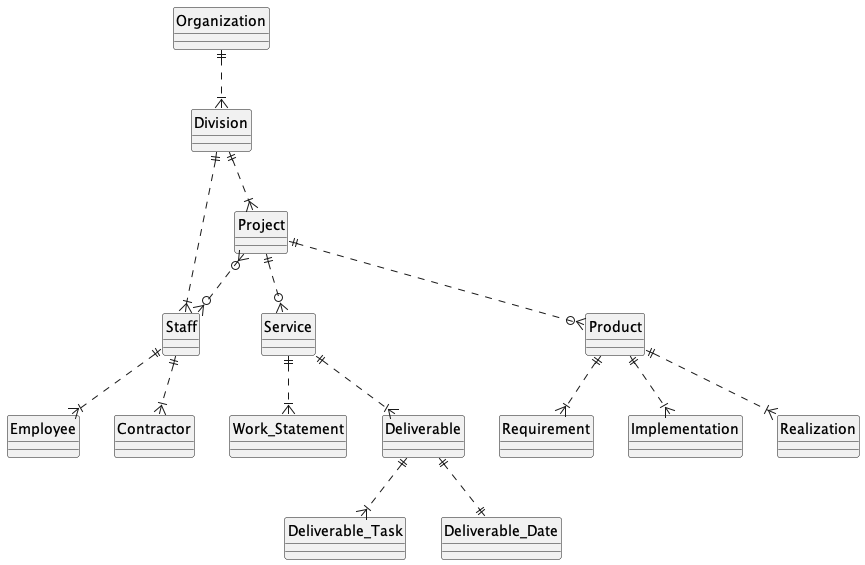
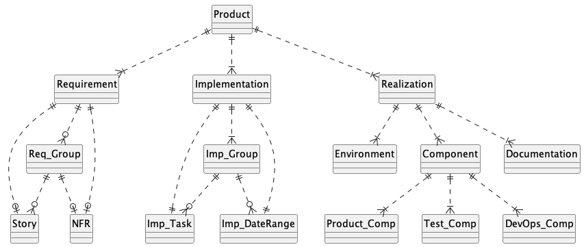

# Entity-Relationship Diagram
Figure 02.02 describes the entities and relationships that comprise the Teamsite application.

##### Figure 02.02 ER Diagram: Organization

 

---

 

Figure 02.03 further details the entities and relationships that comprise the Teamsite product.

##### Figure 02.03 ER Diagram: Product